# 🚀 Sistema Android para gestionar inventarios en Tiempo Real. (MVVM + Room + ApiRest + Retrofit + Testing )

<p float="center">
  
</p>

Aplicación nativa para Android, desarrollada en Kotlin, diseñada para gestionar inventarios de productos en tiempo real. La aplicación se conecta a una **API REST** para realizar operaciones CRUD (Crear, Leer, Actualizar, Eliminar) y persiste los datos localmente usando **Room** como _cache_ y fuente de verdad primaria. La arquitectura se basa en el patrón **Model-View-ViewModel (MVVM)** , utilizando componentes de **Android Jetpack** para crear una aplicación robusta, escalable y reactiva.

---

## 🎯 Requerimientos de Funcionalidad y su Implementación

| Requerimiento                      | Implementación en V5                                                                                                                                                                |
| ---------------------------------- | ----------------------------------------------------------------------------------------------------------------------------------------------------------------------------------- |
| 1. Carga y Sincronización de Datos | El `Repository`  utiliza **Retrofit** para consumir una API REST para la sincronización y actualización del inventario. Los datos se almacenan y se sirven desde **Room Database**. |
| 2. Operaciones CRUD en Tiempo Real | El usuario puede**agregar,  editar,  eliminar y consultar** productos. Todas las operaciones se reflejan en la base de datos local y se **sincronizan** con la API remota.          |
| 3. Lista de Productos              | Muestra una lista navegable (`RecyclerView`) de productos con datos básicos: **ID, Nombre, Precio y Cantidad**.                                                                     |
| 4. Pantallas de Formulario         | Implementa un formulario de entrada (vía `DialogFragment` o `Fragment`) para la creación y edición detallada de productos.                                                          |
| 5. Navegación Segura               | Se utiliza**Navigation Component** con **Safe Args** para gestionar el flujo de la aplicación.                                                                                      |

---

## 🧠 Arquitectura y Tecnología: MVVM, Jetpack, y Persistencia

Se implementa el patrón **MVVM** para una arquitectura limpia,**Dagger Hilt** para la inyección de dependencias, y se utilizan componentes de Android Jetpack para la estructura y reactividad.

| Capa               | Componente                   | Descripción                                                                                                                                            |
| ------------------ | ---------------------------- | ------------------------------------------------------------------------------------------------------------------------------------------------------ |
| Persistencia Local | Room Database y DAO          | Almacena y gestiona `ProductoEntity ` en la base de datos local. El DAO define operaciones CRUD y consultas usando `Flow`.                             |
| Acceso Remoto      | Retrofit y ApiService        | Interfaz de Retrofit que define los*endpoints* de la API REST para las operaciones CRUD, utilizando funciones **`suspend`** de Coroutines.             |
| Repositorio        | **`InventoryRepository.kt`** | Centraliza la lógica de acceso a datos. Decide si cargar desde Room, la API, o sincronizar ambos. Ejecuta llamadas en un `Dispatcher.IO`.              |
| ViewModel          | InventoryViewModel.kt        | Contiene la lógica de negocio y gestión de estados. Utiliza `viewModelScope` y expone el estado de la UI mediante **`StateFlow`** y/o **`LiveData`** . |
| Vista              | **Fragments y Activity**     | Observan `StateFlow` del `ViewModel` para actualizar la UI. Utilizan **View Binding** y **Navigation Component** .                                     |

---

## ✨ Reactividad y Flujo de Datos (Sincronización)

El flujo de datos está diseñado para ser reactivo y manejar la sincronización con la API:

1. **Disparo de la Solicitud:** Un _Fragment_ llama a una función del `ViewModel` (ej.`deleteProduct`).
2. **Transición de Estado:** El `ViewModel` inmediatamente emite un estado **`UiState.Loading`** a través de su `StateFlow`.
3. **Lógica del Repositorio:** El `Repository` ejecuta la operación (ej., eliminar localmente vía Room, y luego llama a la API vía Retrofit).
4. **Ejecución Asíncrona (Coroutines):** Todas las llamadas de I/O (Red y DB) se ejecutan dentro de **Kotlin Coroutines** en el `viewModelScope` utilizando `Dispatchers.IO`.
5. **Actualización de `StateFlow`:** Al finalizar la operación, el `ViewModel` emite el estado final **`UiState.Success`** o **`UiState.Error`** junto con los datos o mensajes correspondientes.
6. **Sincronización de UI:** La interfaz de usuario (Vista) reacciona a este cambio de estado (ej., oculta la barra de progreso y muestra la lista actualizada o un mensaje de error).

---

## 🛠️ Tecnologías usadas

- **IDE** : Android Studio
- **Lenguaje** :**Kotlin** (1.9.22)
- **Arquitectura** :**MVVM** (Model-View-ViewModel).
- **Inyección de Dependencias** :**Dagger Hilt**
- **Conectividad** :**Retrofit** (para API REST)
- **Persistencia** :**Room Database** (SQL Abstraction).
- **Concurrencia** :**Kotlin Coroutines** y `viewModelScope`.
- **Navegación** :**Navigation Component** y **Safe Args** .
- **UI/Reactividad** :**StateFlow/LiveData** (Reactividad) y **View Binding** .

## 🏗️ Funcionamiento de la Aplicación

El flujo de la aplicación se centra en la consulta, adición y actualización de datos:

1. **Inicio (Splash)**: La aplicación comienza con un SplashFragment, donde se oculta toda la UI auxiliar para dar una bienvenida limpia.
2. **Carga de Datos**: Tras el Splash, el MainActivity pide al InventoryViewModel que inicie la llamada asíncrona a la API (vía Retrofit/Repository).
3. **Visualización de Lista**: Una vez que la lista de productos se recibe (por defecto vacía), el LiveData se actualiza y el RecyclerView muestra la lista (ID, Nombre, Producto, Descripción, Precio, Cantidad). Un FAB se hace visible para agregar nuevos productos.
4. **Editar/Eliminar Producto**: Al hacer clic sobre los íconos de delete o edit en un producto, Safe Args transfiere el objeto Producto completo al activity_edit_product.

---

## 🧩 Estrategia de Testeo

Se implementa una estrategia de testeo integral para validar cada capa, manteniendo la independencia entre ambientes de producción y pruebas.

### 1. Pruebas Unitarias (JVM Local)

| **Clase de Prueba**           | **Objetivo**                                                                                                    | **Herramientas Clave**                |
| ----------------------------- | --------------------------------------------------------------------------------------------------------------- | ------------------------------------- |
| **`ProductMapperTest`**       | Asegurar la correcta**conversión**entre `Entity`,`Response`y Modelos de Dominio.                                | JUnit 4                               |
| **`InventoryRepositoryTest`** | Validar la**lógica de sincronización**y delegación de llamadas a la API y Room.                                 | MockK,`runTest`,`TestDispatcherRule`  |
| **`InventoryViewModelTest`**  | Verificar la**gestión de estados**(`Idle`,`Loading`,`Success`,`Error`) y la correcta delegación al Repositorio. | MockK,`runTest`,`StateFlow`collection |

### 2. Pruebas de Interfaz (Instrumentación)

| **Clase de Prueba**         | **Objetivo**                                                                                                                                                      | **Herramientas Clave**     |
| --------------------------- | ----------------------------------------------------------------------------------------------------------------------------------------------------------------- | -------------------------- |
| **`ProductDaoTest`**        | Prueba de Persistencia (In-Memory DB). Asegura que las consultas**SQL** y las operaciones CRUD de Room se ejecutan correctamente en una base de datos en memoria. | Room Testing, JUnit 4/5    |
| `ListaProductosUI_BotonFab` | Verifica que los elementos UI esenciales (lista, botón FAB) se**despliegan** correctamente y que la interacción básica es funcional.                              | Espresso, FragmentScenario |

### 3. Buenas prácticas aplicadas

i. Independencia total entre ambientes de producción y pruebas.

ii. No se sobreescriben versiones ni dependencias desde los archivos Gradle.

iii. Mocks controlados (con MockK) para evitar efectos colaterales.

iv. Reglas de entorno limpias (InstantTaskExecutorRule, TestDispatcherRule) que restauran el estado tras cada test.

v. Pueden ejecutarse múltiples veces sin producir resultados distintos.

---

## ⭐ Capturas de Pantalla

<table width="100%">
    <tr>
        <td align="center" width="33%">
            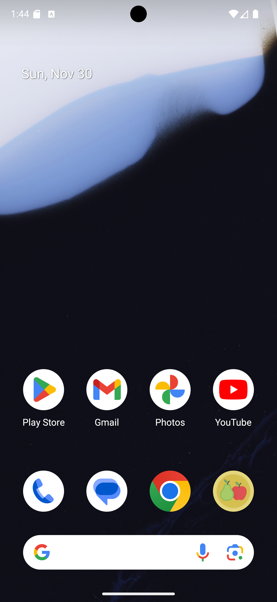
        </td>
        <td align="center" width="33%">
            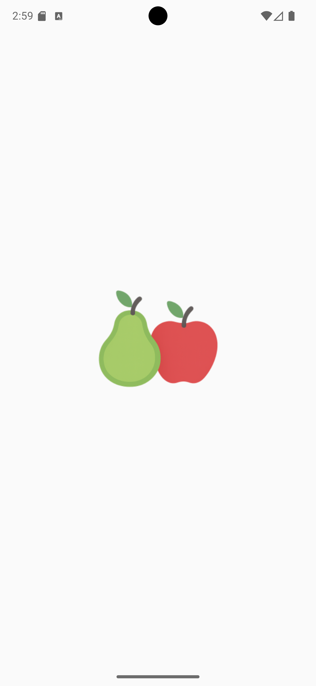
        </td>
        <td align="center" width="33%">
            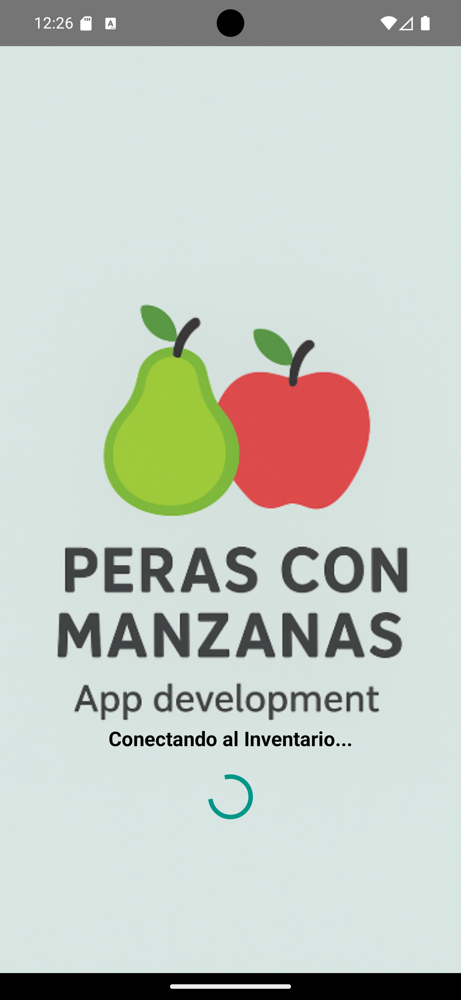
        </td>
    </tr>
    <tr>
        <td align="center">App instalada</td>
        <td align="center">Al lanzar la App</td>
        <td align="center">Landing y bienvenida</td>
    </tr>
    <tr>
        <td align="center">
            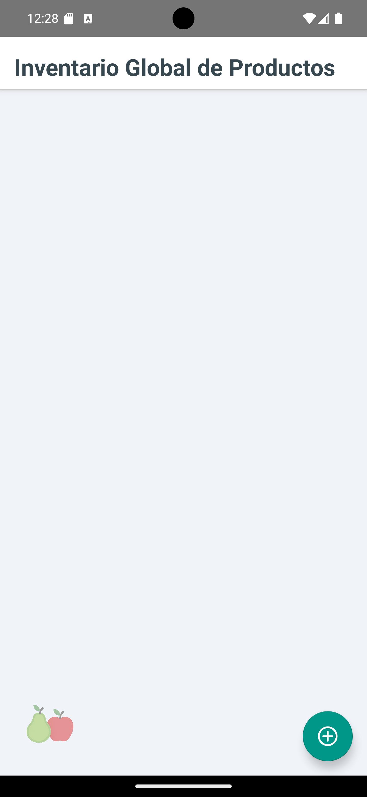
        </td>
        <td align="center">
            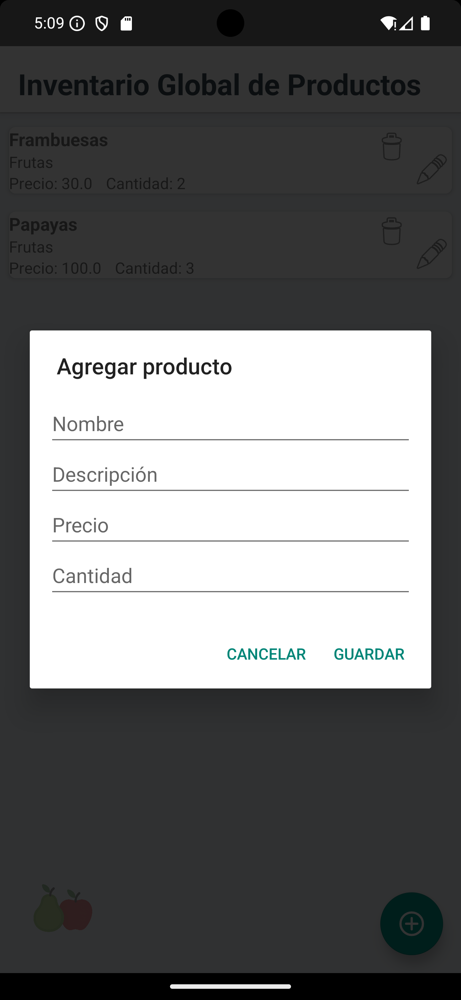
        </td>
        <td align="center">
            
        </td>
    </tr>
    <tr>
        <td align="center">Listado inicial (por defecto vacía), muestra íconos para borrar o editar</td>
        <td align="center">Agregar un producto</td>
        <td align="center">Agregar producto ejemplo "Zapallo"</td>
    </tr>
    <tr>
        <td align="center">
            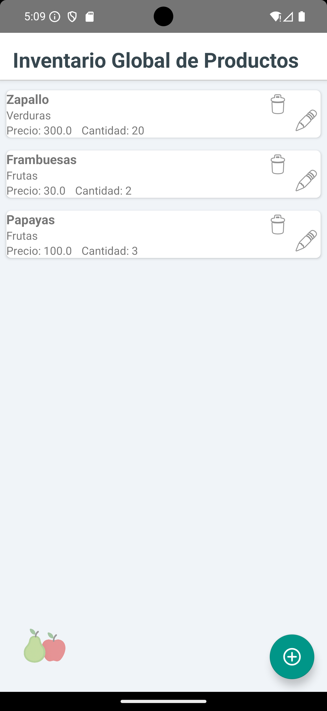
        </td>
        <td align="center">
            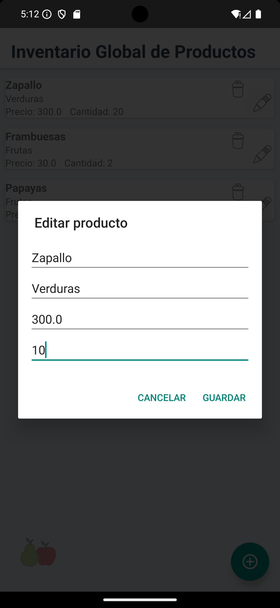
        </td>
        <td align="center">
            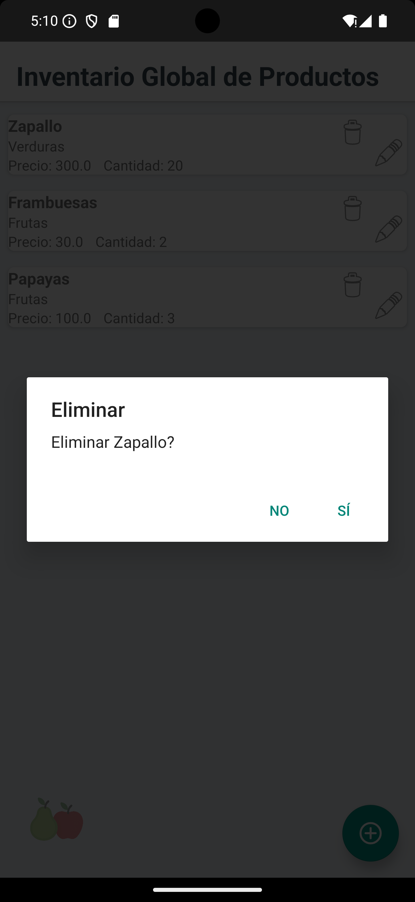
        </td>
    </tr>
    <tr>
        <td align="center">Producto 'Zapallo' agregado</td>
        <td align="center">Editar producto 'Zapallo'</td>
        <td align="center">Borrar producto 'Zapallo'</td>
    </tr>
    <tr>
        <td align="center">
            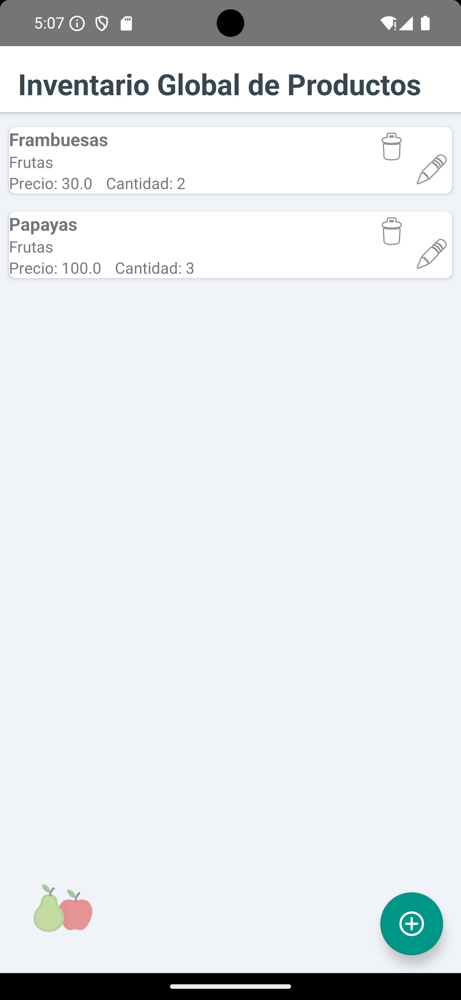
        </td>
        <td align="center">
            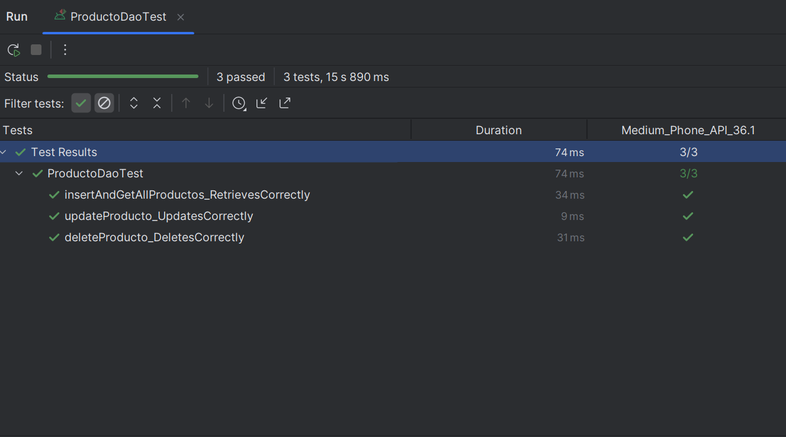
        </td>
        <td align="center">
            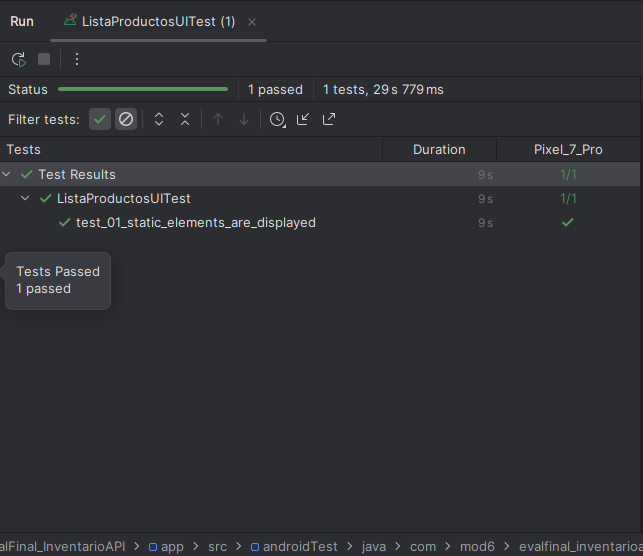
        </td>
    </tr>
    <tr>
        <td align="center">Listado actualizado</td>
        <td align="center">Prueba UI01: Insertar producto</td>
        <td align="center">Prueba UI02: Lista productos</td>
    </tr>
     <tr>
        <td align="center">
            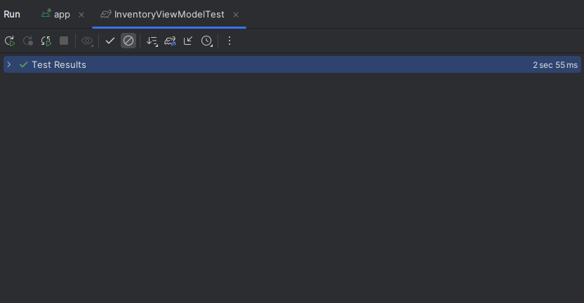
        </td>
        <td align="center">
            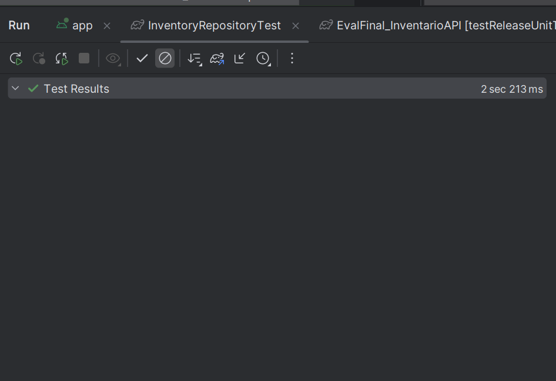
        </td>
        <td align="center">
            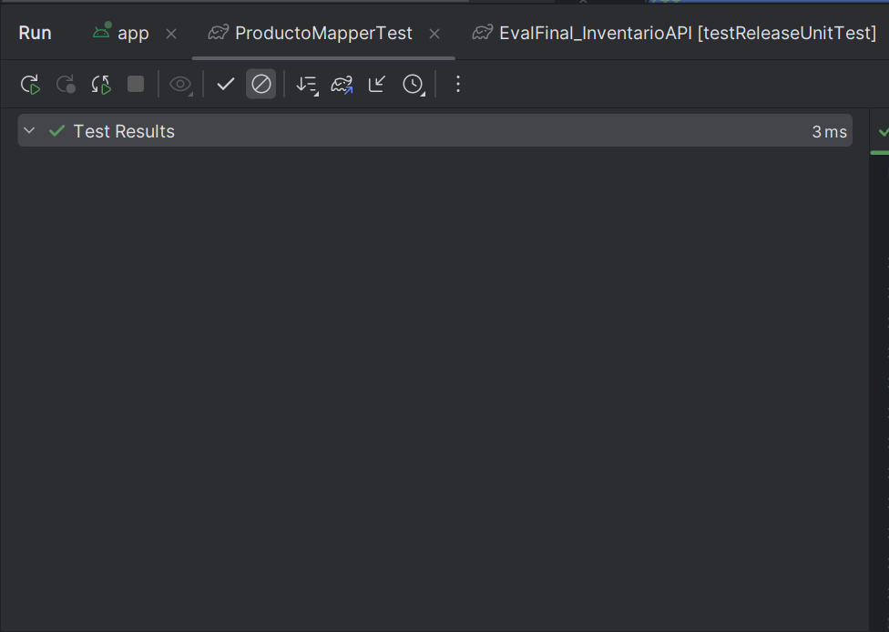
        </td>
    </tr>
    <tr>
        <td align="center">Prueba Unitaria: ViewModel</td>
        <td align="center">Prueba Unitaria: Repository</td>
        <td align="center">Prueba Unitaria: Mapeo de productos</td>
    </tr>
</table>

---

## 🔎 Guía de Ejecución del Proyecto

**Para ejecutar este proyecto en tu entorno de desarrollo, siga estos 'quick steps':**

    1.**Clonar el Repo:** Clona el proyecto en su máquina local.

    2.**Abrir en Android Studio:** Seleccione **"Open an existing Android Studio project"** y navegue a la carpeta clonada. El IDE detectará automáticamente la configuración de Gradle.

    3.**Sincronizar Gradle:** Haz clic en el botón "Sync Now" si Android Studio te lo solicita. Esto descargará todas las dependencias necesarias.

    4.**Ejecutar:** Conecta un dispositivo Android físico o inicia un emulador. Luego, haz clic en el botón "Run 'app'" (el ícono de la flecha verde) para desplegar la aplicación.

**Para ejecutar este proyecto en tu celular, sigue estos 'quick steps':**

    1.**Copiar la APK:** Copia la aplicación (APK) en tu celular.

    2.**Instalar:** Instala la aplicación, salta los avisos de advertencia, es normal si la aplicación no ha sido productivizada la plataforma de Android.

    3.**Abrir la App:** Haz doble clic en el ícono de _**Peras con Manzanas para abrir**_ "GesTarea V5".

    4.**Recorrer las opciones:** Cliquea en las opciones y podrás acceder al listado de eventos, editar cada evento, crear nuevos eventos, regresando a cualquier punto de la app.

---

## 🛑 Instalación y Configuración

a. **Clonar el repositorio:**

```bash

https://github.com/jcordovaj/EvalFinal_InventarioAPI.git

```

b. **Abrir el Proyecto en Android Studio:**

b.1. Abrir Android Studio.

b.2. En la pantalla de bienvenida, seleccionar **"Open an existing Android Studio project"** (Abrir un proyecto de Android Studio existente).

b.3. Navegar a la carpeta donde se clonó el repositorio y seleccionarla. Android Studio detectará automáticamente el proyecto de Gradle y comenzará a indexar los archivos.

c. **Sincronizar Gradle:**

c.1. Este es el paso más importante. Después de abrir el proyecto, Android Studio intentará sincronizar la configuración de Gradle. Esto significa que descargará todas las librerías, dependencias y plugins necesarios para construir la aplicación. Normalmente, una barra de progreso se mostrará en la parte inferior de la consola de Android Studio con un mensaje como **"Gradle Sync in progress"**.

c.2. Si no se inicia, o si el proceso falla, intente con el botón **"Sync Project with Gradle Files"** en la barra de herramientas. Es el icono con el **"elefante" de Gradle**. Eso forzará la sincronización.

c.3. Esperar que el proceso de sincronización termine. De haber errores, puede ser por problemas en la configuración de Android u otros conflictos, la aplicación debe descargar lo que requiera y poder ser ejecutada "AS-IS".

d. **Configurar el Dispositivo o Emulador:**

Para ejecutar la aplicación, se requiere un dispositivo Android, puedes usarse el emulador virtual o un dispositivo físico.

d.1. Emulador: En la barra de herramientas, haga click en el botón del "AVD Manager" (Android Virtual Device Manager), que es el icono de un teléfono móvil con el logo de Android. Desde ahí, puedes crear un nuevo emulador con la versión de Android que prefiera (Nota: Debe considerar que cada celular emulado, puede requerir más de 1GB de espacio en disco y recursos de memoria).

d.2. Dispositivo físico: Conecte su teléfono Android a la computadora con un cable USB (también puede ser por WI-FI). Asegúrese de que las **Opciones de desarrollador y la Depuración por USB** estén habilitadas en su dispositivo. Consulte a su fabricante para activar estas opciones.

e. **Ejecutar la aplicación:**

e.1. Seleccione el dispositivo o emulador deseado en la barra de herramientas del emulador.

e.2. Haga click en el botón "Run 'app'" (el triángulo verde en la parte superior, o vaya al menu "RUN") para iniciar la compilación y el despliegue de la aplicación, puede tardar algunos minutos, dependiendo de su computador.

e.3. Si todo ha sido configurado correctamente, la aplicación se instalará en el dispositivo y se iniciará automáticamente, mostrando la pantalla de inicio.

---

## 📦 Generación del Paquete de Producción (APK/AAB)

Para subir la aplicación a Google Play Store o distribuirla, debes generar un paquete de _release_ (generalmente un AAB) firmado.

### 1 Generar la Clave de Firma (Si es la primera vez)

1. En Android Studio, ve a **Build > Generate Signed Bundle / APK...** .
2. Selecciona **Android App Bundle** (recomendado para Play Store) o **APK** . Haz clic en **Next** .
3. En la ventana **Key store path** , haz clic en **Create new...** .
4. Rellena todos los campos (ubicación, contraseña, _alias_ ) y haz clic en **OK** . **Guarda esta clave de forma segura.**

### 2 Generar el Paquete de Release

1. Ve a **Build > Generate Signed Bundle / APK...** .
2. Selecciona el formato deseado (AAB o APK) y haz clic en **Next** .
3. **Key store path:** Selecciona el archivo `.jks` que creaste en el paso anterior.
4. Introduce la **Key store password** y la **Key alias password** .
5. **Build variants:** Selecciona **`release`** .
6. **Signature versions:** Marca **V1 (JAR Signing)** y **V2 (Full APK Signature)** .
7. Haz clic en **Finish** .

El archivo de producción (`app-release.aab` o `app-release.apk`) se generará en el directorio `app/release/`. Este archivo está listo para su distribución.

---

## 🎉 Contribuciones (Things-To-Do)

Se puede contribuir reportando problemas o con nuevas ideas, por favor respetar el estilo de programación y no subir código basura. Puede utilizar: forking del repositorio, crear pull requests, etc. Toda contribución es bienvenida.

---

## 🔹 Licencia

GPL-3.0 license.

---
